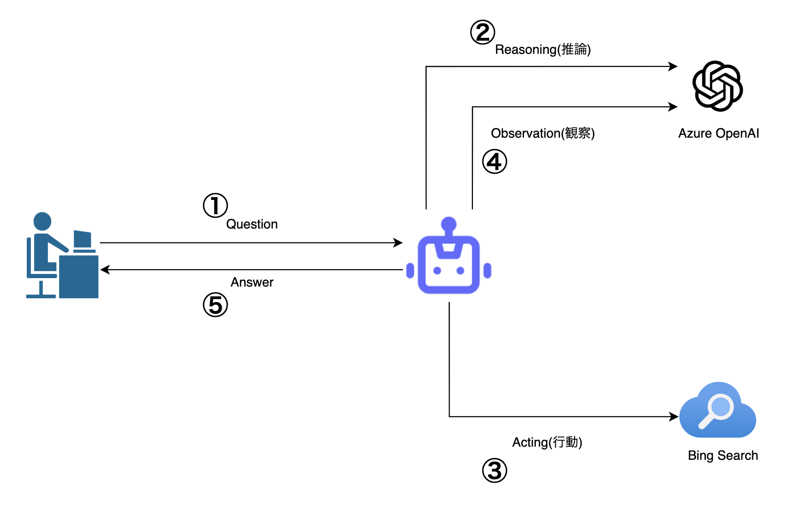

# ReAct アプリケーション

## 全体アーキテクチャ

1. 人からの質問
2. OpenAI へ質問を投げかける。(この時 OpenAI へ送るプロンプトにツールとして BingSearch が使えることを含める)
3. OpenAI だけでの解答が難しい場合は、BingSearch を使って検索を行い、情報を得る
4. BingSearch から得た情報も含めて再度 OpenAI へ情報を送り、回答の要約を作成する
5. 人へ回答を返す

## 検証方法

Azure へリソースを Deploy

以下 3 つのリソースが作成されます。

- Azure OpenAI Service
- Bing Search
- Azure Static Web Apps

Azure へ移動し、Azure Static Web Apps のデプロイ設定へ github の URL を指定し、CI/CD を有効にします。

自動デプロイが完了した後、Azure Static Web Apps の URL へアクセスします。
